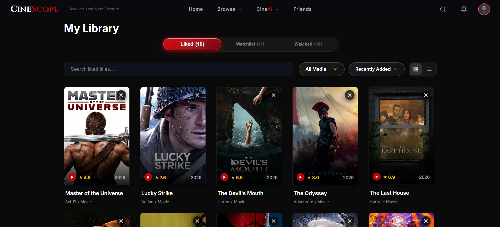

# CineScope

<div align="center">

> **Search Less. Watch Better.**

[](https://react.dev/)
[](https://vitejs.dev/)
[](https://firebase.google.com/)
[](https://ai.google.dev/)
[](https://vercel.com/)

An intelligent, AI-powered movie and TV discovery platform designed to eliminate choice paralysis. Powered by real-time TMDB content data, Google Gemini AI reasoning, and Firebase authentication & database services.

👉 **[Launch CineScope Live Demo](https://cine-scope-ivory-one.vercel.app)** 👈

</div>

---

## 🚀 Live Demo

Experience CineScope live in your browser:  
👉 **[https://cine-scope-ivory-one.vercel.app](https://cine-scope-ivory-one.vercel.app)**


---

## 📸 Screenshots

| Feature Section | Preview |
| :--- | :--- |
| **Hero Landing Page** |  |
| **Media Browse & Discovery** |  |
| **Movie & TV Details** |  |
| **CineAI Discovery Engine** |  |
| **Social & Friend Movie Match** |  |
| **AI Group Watch & Match Recs** |  |
| **Personal Library & Collections** |  |
| **Achievements System** |  |
| **User Profile & Stats** |  |

---

## 1. Project Overview

Finding something great to watch shouldn't feel like a chore. Modern streaming platforms present thousands of options without meaningful context, forcing viewers to jump between review sites, trailer links, and decision wheels. **CineScope** solves decision fatigue by combining instant TMDB catalog searching with conversational AI guidance and real-time social movie matching.

Instead of browsing endless grid thumbnails, CineScope users can express exact moods, run structured AI movie night planners, challenge two movies to an automated AI debate, or compare taste compatibility with friends to find what to watch together—all while keeping track of their watchlists, ratings, and unlocked achievements.

---

## 2. Key Features

### 🎬 Discover & Search
* **Trending & Catalog Explorer**: Browse popular movies, top-rated series, and genre collections with high-resolution backdrops, logos, and official trailers.
* **Spotlight Search Modal**: Instant overlay search for titles, actors, directors, and genres with auto-suggest and dynamic popular recommendations.
* **Actor & Director Profiles**: Complete filmography, biography, and media breakdowns for cast and crew.
* **TV Season & Episode Guide**: Deep-dive into TV series with season lists, episode descriptions, runtimes, and individual episode backdrops.

### ✨ CineAI Intelligence Suite
* **Natural Language Watch Assistant**: Enter prompt-based requests (*"dark sci-fi thrillers with mind-bending twists"*) to receive AI recommendations with custom 1–2 sentence comparative rationales.
* **Movie Night Planner**: Interactive guided questionnaire tailored for solo viewing, couples, or group movie nights based on vibe, duration, and era preferences.
* **Pick For Me**: Instant decision spinner with mood filters for quick recommendations when stuck.
* **Movie Debate Engine**: Head-to-head AI analysis comparing any two movies across acting, direction, pacing, score, and visuals with dynamic category point allocations.

### 🤝 Friends & Social Match
* **Unique Friend Codes**: Connect with friends using 6-character alphanumeric friend codes (`CS-XXXXXX`).
* **Movie Match Engine**: Compare watch history and taste overlaps with friends to get an instant compatibility percentage score.
* **Friend-to-Friend Recommendations**: Send inline movie recommendations directly to friends with custom notes, delivered via real-time notifications.

### ❤️ Library & Watchlist
* **Personal Media Collections**: Separate tabs for *Watchlist*, *Liked*, *Watched*, and *Recently Viewed* titles.
* **Automatic TMDB Data Repair**: Automatically resolves and syncs TMDB vote averages for saved items to prevent stale ratings.
* **Watch Time Analytics**: Tracks cumulative minutes spent watching movies and TV series across your library.

### 🏆 Gamified Achievements
* **Milestone Unlocking**: Automatic tracking and unlocking of 15+ achievements (*First Steps*, *Collector*, *AI Explorer*, *Curious Mind*, *Trailer Seeker*).
* **Swipe-to-Dismiss Toasts**: Interactive Framer Motion toast notifications with drag-to-dismiss gestures on mobile viewports.

---

## 3. How CineScope is Different

Most movie database applications function as passive reference guides. CineScope actively transforms media discovery through three core pillars:

1. **Active Decision-Making**: Rather than relying purely on passive static lists, CineScope provides tools like the *Movie Night Planner* and *Movie Debate* to help users make final decisions.
2. **Context-Aware AI Guidance**: AI responses explain *why* a film fits a user's prompt or group mood instead of simply returning generic keyword matches.
3. **Integrated Social Compatibility**: Instead of asking friends for verbal recommendations, users can run *Movie Match* to find optimal films that satisfy both people's viewing history.

---

## 4. Tech Stack

* **Frontend Core**: React 19, Vite 8, JavaScript (ES6+)
* **Styling & Motion**: Vanilla CSS3 (Custom Design System, Liquid Glassmorphism), Framer Motion 12
* **Backend & Authentication**: Firebase Realtime Database, Firebase Authentication (Email/Password, Google Sign-In, Anonymous Guest Mode)
* **External APIs**: TMDB (The Movie Database) API, Google Gemini API / Groq LLaMA / OpenRouter
* **Deployment & Serverless**: Vercel (API Rewrites & Proxying)

---

## 5. AI Features Breakdown

CineScope leverages large language models (via Google Gemini / Groq LLaMA / OpenRouter APIs) to power decision-making workflows:

| AI Feature | User Input | AI Output & Behavior |
| :--- | :--- | :--- |
| **What Should I Watch?** | Natural language mood or scenario prompt | Curated list of matching movies with custom 1–2 sentence rationales |
| **Movie Night Planner** | Multi-step questionnaire (Vibe, Group Size, Era) | Personalized recommendations matching the exact viewing situation |
| **Pick For Me** | Selected mood filter / genre preference | A single highlight recommendation with an encouraging AI explanation |
| **Movie Debate** | Selection of two competing movie titles | Head-to-head evaluation across acting, plot, visuals, pacing, and score with point totals |
| **Friend Movie Match** | Selected friend profile comparison | AI compatibility breakdown and shared watch suggestions |

---

## 6. Firebase Integration

Firebase handles authentication and user data storage:

* **Authentication**: Supports standard Email/Password login, Google OAuth Sign-In, and instant Guest Access with seamless account linking.
* **Realtime Database Structures**:
  * `users/{userId}/watchlist`: User's saved watchlist movies.
  * `users/{userId}/liked`: User's favorited titles.
  * `users/{userId}/watched`: Tracked watched items with runtime logs.
  * `users/{userId}/recentlyViewed`: History of recently viewed detail pages.
  * `users/{userId}/achievements`: Unlocked user achievements and progress counters.
  * `friendCodes/{code}`: Global lookup table mapping 6-character friend codes to user IDs.
  * `users/{userId}/friends` & `requests`: Bilateral friend relationships and pending requests.
  * `users/{userId}/notifications`: In-app notifications for friend requests and movie recommendations.

---

## 7. Getting Started

Follow these steps to set up and run CineScope locally:

### Prerequisites
* **Node.js**: v18.0.0 or higher
* **npm**: v9.0.0 or higher

### Installation

1. **Clone the repository**:
   ```bash
   git clone https://github.com/pg13atif-prog/Code-Blooded.git
   ```

2. **Navigate into the project directory**:
   ```bash
   cd Code-Blooded
   ```

3. **Install dependencies**:
   ```bash
   npm install
   ```

4. **Configure environment variables**:
   Create a `.env` file in the root directory (see section below for required variables).

5. **Start the local development server**:
   ```bash
   npm run dev
   ```

6. Open your browser and navigate to `http://localhost:5173`.

---

## 8. Environment Variables

Create a `.env` file in the root of the project with the following environment variables:

```env
# TMDB API Configuration
VITE_TMDB_API_KEY=your_tmdb_api_key

# Firebase Configuration
VITE_FIREBASE_API_KEY=your_firebase_api_key
VITE_FIREBASE_AUTH_DOMAIN=your_project.firebaseapp.com
VITE_FIREBASE_DATABASE_URL=https://your_project.firebaseio.com
VITE_FIREBASE_PROJECT_ID=your_project_id
VITE_FIREBASE_STORAGE_BUCKET=your_project.appspot.com
VITE_FIREBASE_MESSAGING_SENDER_ID=your_messaging_sender_id
VITE_FIREBASE_APP_ID=your_app_id
VITE_FIREBASE_MEASUREMENT_ID=your_measurement_id

# AI API Providers (Groq / OpenRouter)
VITE_GROQ_API_KEY=your_groq_api_key
VITE_OPENROUTER_API_KEY=your_openrouter_api_key
```

> **Note**: Do not commit your `.env` file to source control. It is included in `.gitignore`.

---

## 9. Project Structure

```text
Code-Blooded/
├── api/                        # Vercel serverless proxy functions
│   ├── ratings.js              # Community rating endpoint
│   └── tmdb.js                 # Secure TMDB API proxy
├── public/                     # Static public assets
├── screenshots/                # Application preview screenshots
├── src/
│   ├── assets/                 # SVGs and static visual assets
│   ├── components/             # Reusable UI components
│   │   ├── AuthModal.jsx       # Authentication modal (Sign In / Register)
│   │   ├── CustomSelect.jsx    # Styled custom dropdown select
│   │   ├── Hero.jsx            # Dynamic hero backdrop slider & trailers
│   │   ├── MovieCard.jsx       # Interactive movie poster card
│   │   ├── MovieRow.jsx        # Horizontal movie slider row
│   │   ├── Navbar.jsx          # Glassmorphic header & spotlight search
│   │   ├── SkeletonLoader.jsx  # Content loading skeletons
│   │   └── SplashScreen.jsx    # Initial application splash animation
│   ├── context/                # React context providers
│   │   ├── AlertContext.jsx    # Global alerts & achievement toasts
│   │   └── AuthContext.jsx     # Firebase Auth state management
│   ├── hooks/                  # Custom React hooks
│   ├── pages/                  # Main application views
│   │   ├── cineai/             # Dedicated CineAI tool pages
│   │   │   ├── MovieDebate.jsx # Head-to-head movie comparison
│   │   │   ├── MoviePlanner.jsx# Movie night planning quiz
│   │   │   └── PickForMe.jsx   # Random mood decision spinner
│   │   ├── AchievementsPage.jsx# Gamified achievements dashboard
│   │   ├── AiDiscoveryPage.jsx # Conversational AI watch assistant
│   │   ├── DiscoverPage.jsx    # Main media browse & filter page
│   │   ├── FriendsPage.jsx     # Friend list, search & request manager
│   │   ├── MovieDetail.jsx     # Comprehensive movie/show detail page
│   │   ├── PersonDetailPage.jsx# Director & actor filmography view
│   │   ├── ProfilePage.jsx     # Account profile & stats dashboard
│   │   ├── SocialPage.jsx      # Friend Movie Match compatibility view
│   │   └── UserListPage.jsx    # Personal library collections
│   ├── services/               # API & data service modules
│   │   ├── achievements.js     # Achievement tracking rules & evaluator
│   │   ├── firebase.js         # Firebase app initialization
│   │   ├── firestore.js        # Realtime database CRUD operations
│   │   ├── friends.js          # Friend relationships & code lookup
│   │   ├── gemini.js           # AI inference logic & prompt engineering
│   │   └── tmdb.js             # TMDB API client & data mappers
│   ├── App.jsx                 # Main application router & state manager
│   ├── main.jsx                # Application entry point
│   └── index.css               # Global CSS design system & tokens
├── vercel.json                 # Vercel deployment configuration
├── vite.config.js              # Vite build & proxy configuration
└── package.json                # Dependencies and npm scripts
```

---

## 10. Deployment

CineScope is configured for seamless deployment on **Vercel**:

1. **Frontend Hosting**: Single Page Application routing handled via `vercel.json` rewrites (`/((?!api/).*) -> /index.html`).
2. **Serverless API Proxying**: API requests to `/api/tmdb/*` are proxied through serverless handlers in `/api/tmdb.js` to protect TMDB API keys and prevent CORS restrictions.

---

## 11. Team & Acknowledgments

* **Project**: CineScope (Code-Blooded)
* **Built for**: Hackathon Project

---

## 12. Future Improvements

* **Custom User Playlists**: Ability to create custom themed playlists (e.g. *"Halloween Horror Night"*).
* **Trailer Queue Mode**: Continuous autoplay queue for trending trailers.
* **Offline Caching**: Enhanced offline bookmarking for saved watchlists.

---

## 13. License

This project was created as a hackathon project.
