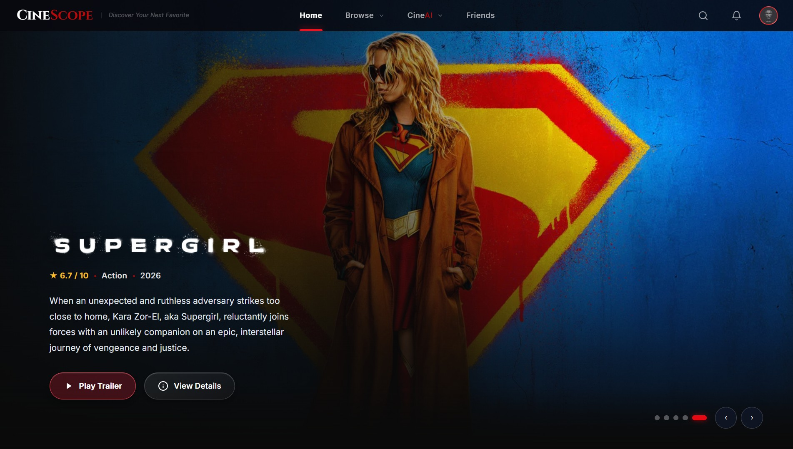
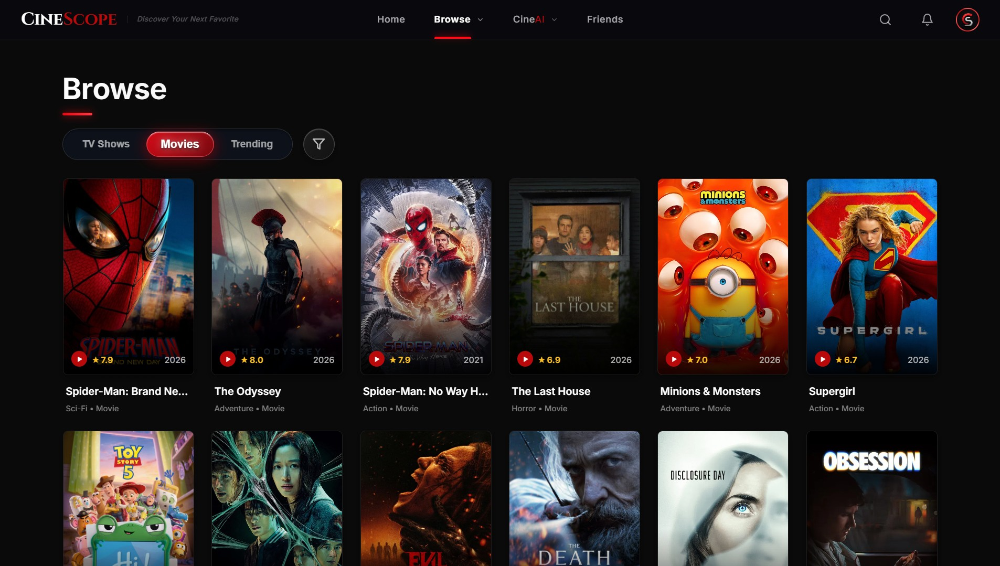
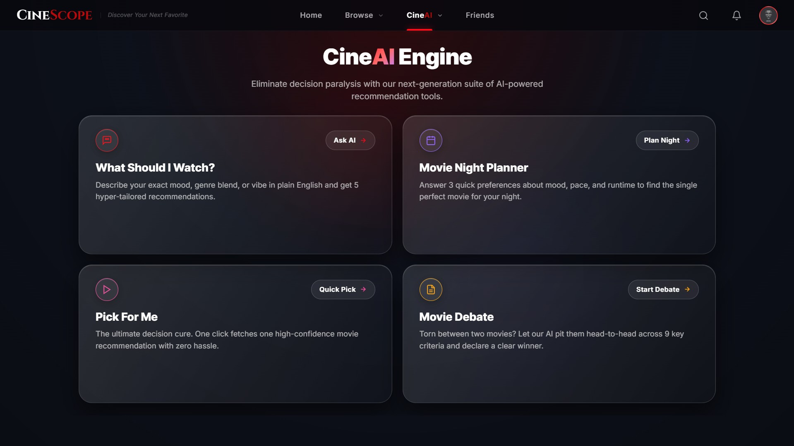
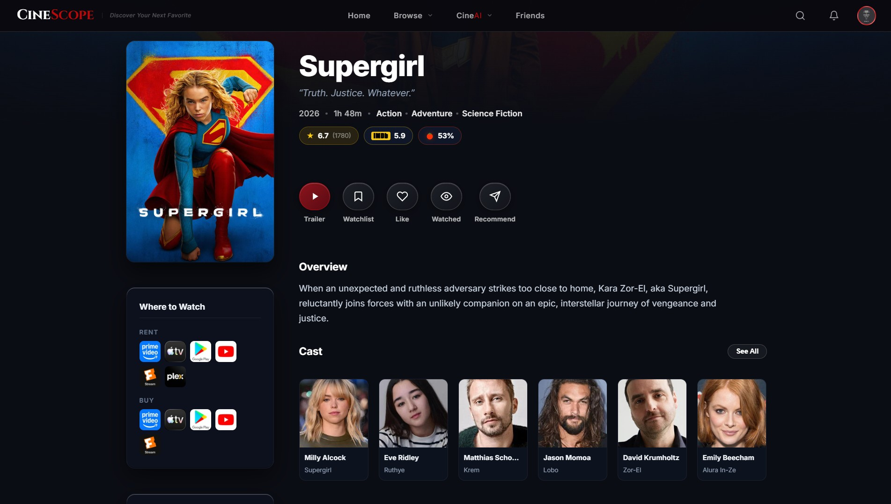
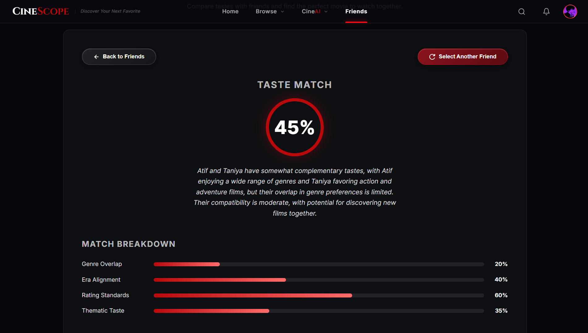
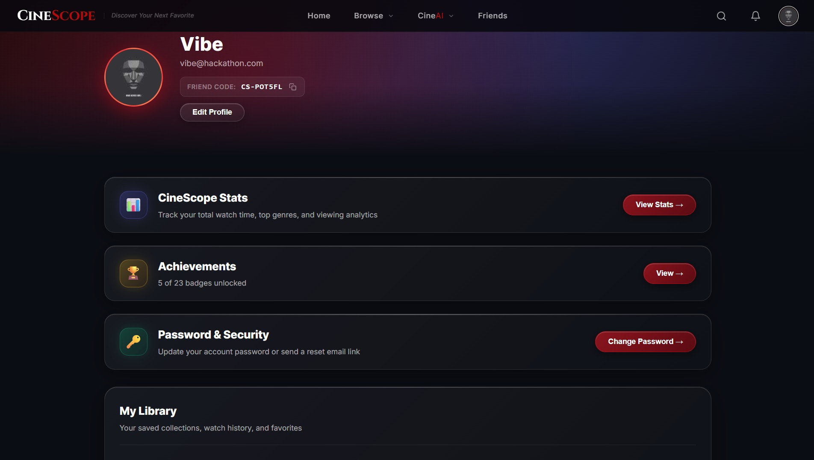
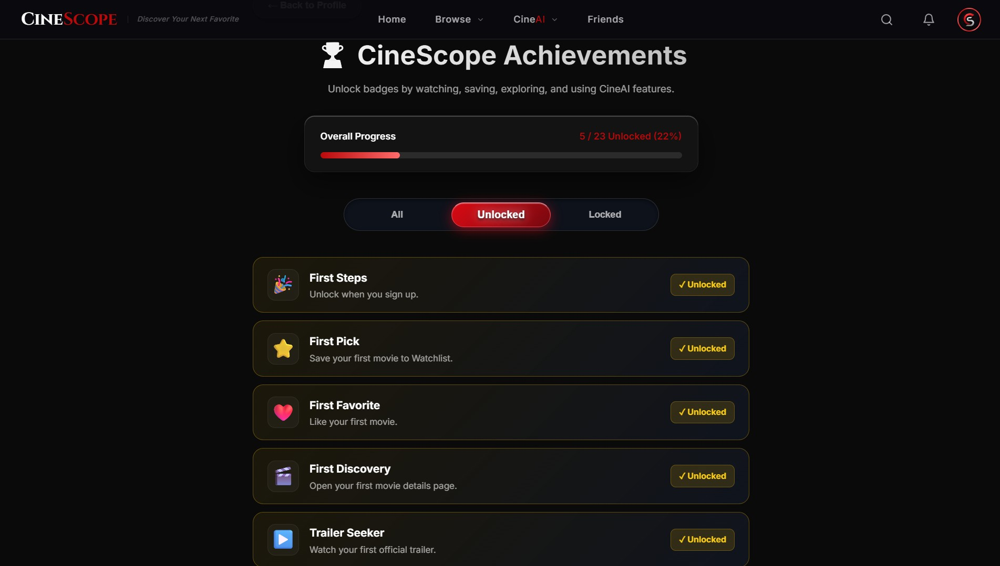

# 🎬 CineScope

### *Search Less. Watch Better.*

CineScope is an intelligent media discovery platform that combines TMDB content browsing, AI reasoning (Groq / OpenRouter), and real-time social movie matching to eliminate choice paralysis.

**[🚀 Live Demo](https://cinescopeai.vercel.app)**

<br/>



---

## ✨ Why CineScope?

Finding something great to watch shouldn't feel like endless scrolling. CineScope solves decision fatigue through active, AI-assisted discovery:

| ❌ Traditional Browsing | ✅ The CineScope Experience |
| :--- | :--- |
| **Endless Card Scrolling**: Spending 30+ minutes looking for a title | **Conversational AI Assistant**: Describe your vibe & get rationalized picks |
| **Choice Paralysis**: Overwhelmed by thousands of uncontextualized titles | **Guided Decision Tools**: Interactive Movie Night Planner & Pick For Me |
| **Tabs Overload**: Bouncing between trailers and review sites | **Integrated Media Hub**: Trailers, cast filmographies, and AI Movie Debates |
| **Asking Friends "What to Watch?"**: Unstructured verbal recommendations | **Social Movie Match**: Instant compatibility scoring & taste overlaps |

---

## 🎬 Key Features

### 🎬 Discover
* **Spotlight Search**: Instant command overlay (`Ctrl+K` / `Cmd+K`) searching titles, actors, directors, and genres.
* **Catalog Explorer**: Browse trending movies, series, season guides, and official YouTube trailers.
* **Person Profiles**: Complete filmographies, biographies, and media breakdowns for cast & crew.

### ✨ CineAI
* **What Should I Watch?**: Prompt-driven natural language recommendations with contextual rationales.
* **Movie Night Planner**: Interactive quiz tailored for solo, couples, or group movie nights.
* **Pick For Me**: Instant decision spinner with mood filters.
* **Movie Debate**: Head-to-head AI analysis comparing any two films across acting, plot, visuals, pacing, and score.

### 🤝 Friends & Social
* **Friend Codes**: Connect using unique 6-character codes (`CS-XXXXXX`).
* **Movie Match**: Calculate taste compatibility percentages based on watch history.
* **In-App Recommendations**: Send inline movie recommendations directly to friends with custom notes.

### ❤️ Watchlist & Library
* **Personal Collections**: Organizes *Watchlist*, *Liked*, and *Watched* titles.
* **Watch Time Analytics**: Live calculation of total hours and minutes watched.

### 🏆 Achievements
* **Gamified Milestones**: Unlock 15+ achievement badges as you browse, save, and watch.
* **Animated Toasts**: Framer Motion notifications with swipe-to-dismiss support on mobile.

---

## 📸 Screenshots

<table width="100%">
<tr>
  <td width="50%">
    <h4 align="center">🍿 Media Browse & Discovery</h4>
    
  </td>
  <td width="50%">
    <h4 align="center">✨ CineAI Discovery Engine</h4>
    
  </td>
</tr>
<tr>
  <td width="50%">
    <h4 align="center">🎬 Movie & TV Details</h4>
    
  </td>
  <td width="50%">
    <h4 align="center">🤝 Friend Movie Match</h4>
    
  </td>
</tr>
<tr>
  <td width="50%">
    <h4 align="center">👤 Profile & Taste Analytics</h4>
    
  </td>
  <td width="50%">
    <h4 align="center">🏆 Gamified Achievements</h4>
    
  </td>
</tr>
</table>

---

## 🧠 How CineAI Works

CineScope integrates large language models (Groq LLaMA / OpenRouter) to turn vague user intents into actionable watch decisions:

| AI Workflow | User Input | AI Output & Behavior |
| :--- | :--- | :--- |
| **Watch Assistant** | Natural prompt (*"dark sci-fi with mind-bending twists"*) | Curated recommendations paired with 1–2 sentence rationales |
| **Movie Night Planner** | Vibe, group size, and era selections | Tailored picks for solo, date, or group movie nights |
| **Pick For Me** | Mood filter selection | Single highlighted recommendation with instant rationale |
| **Movie Debate** | Selection of two competing titles | Head-to-head score comparison across acting, plot, pacing, visuals, & score |
| **Movie Match AI** | Friend profile comparison | Joint compatibility score and shared watch recommendations |

---

## 🔥 Firebase

Firebase Realtime Database and Authentication power CineScope's backend state and social features:

* **Authentication**: Supports Email/Password login, Google OAuth 2.0, and instant Guest Access with account linking.
* **Persistent Library**: Syncs Watchlist, Liked titles, and Watched history in real time.
* **Social Graph & Friend Codes**: Manages 6-character friend codes (`CS-XXXXXX`), friend requests, relationships, and in-app notifications.
* **Gamification & Progress**: Tracks unlocked achievement milestones and progress counters per account.

---

## 🛠️ Tech Stack

| Layer | Technologies Used |
| :--- | :--- |
| **Frontend** | React 19, Vite 8, Framer Motion 12, Vanilla CSS3 (Liquid Glassmorphism) |
| **Backend & Data** | Firebase Realtime Database, Firebase Authentication |
| **APIs & AI** | TMDB API, Groq LLaMA / OpenRouter AI |
| **Deployment** | Vercel (Single Page App rewrites & serverless API proxy) |


---

## 🚀 Getting Started

### Prerequisites
* **Node.js**: v18.0.0 or higher
* **npm**: v9.0.0 or higher

### Installation

1. **Clone the repository**:
   ```bash
   git clone https://github.com/pg13atif-prog/Code-Blooded.git
   cd Code-Blooded
   ```

2. **Install dependencies**:
   ```bash
   npm install
   ```

3. **Configure environment variables**:
   Create a `.env` file in the root directory (see section below).

4. **Start the local development server**:
   ```bash
   npm run dev
   ```

5. Open your browser at `http://localhost:5173`.

---

## 🔐 Environment Variables

Create a `.env` file in the root directory:

```env
# TMDB API Key
VITE_TMDB_API_KEY=your_tmdb_api_key

# Firebase Credentials
VITE_FIREBASE_API_KEY=your_firebase_api_key
VITE_FIREBASE_AUTH_DOMAIN=your_project.firebaseapp.com
VITE_FIREBASE_DATABASE_URL=https://your_project.firebaseio.com
VITE_FIREBASE_PROJECT_ID=your_project_id
VITE_FIREBASE_STORAGE_BUCKET=your_project.appspot.com
VITE_FIREBASE_MESSAGING_SENDER_ID=your_messaging_sender_id
VITE_FIREBASE_APP_ID=your_app_id
VITE_FIREBASE_MEASUREMENT_ID=your_measurement_id

# AI API Keys
VITE_GROQ_API_KEY=your_groq_api_key
VITE_OPENROUTER_API_KEY=your_openrouter_api_key
```

> ⚠️ **Security Note**: Never commit your `.env` file or secret keys to the repository. Frontend `VITE_*` variables are bundled into the client build.

---

## 📁 Project Structure

```text
Code-Blooded/
├── api/              # Vercel serverless API handlers
├── public/           # Static public assets
├── screenshots/      # Product preview screenshots
├── src/
│   ├── assets/       # Media assets and icons
│   ├── components/   # Reusable UI components
│   ├── context/      # React state providers (Auth, Alerts)
│   ├── hooks/        # Custom React hooks
│   ├── pages/        # Application views (Discover, Profile, MovieDetail, CineAI)
│   │   └── cineai/   # CineAI suite pages (Planner, PickForMe, Debate)
│   ├── services/     # API & Firebase integration modules
│   ├── App.jsx       # Main application layout & router
│   ├── main.jsx      # Entry point
│   └── index.css     # Global CSS design system
├── vercel.json       # Deployment rewrites
├── vite.config.js    # Vite configuration & proxy
```

---

## 🔮 Future Improvements

* **Custom Playlist Collections**: Create and share custom themed movie lists.
* **Autoplay Trailer Theater**: Continuous video queue mode for trending trailers.

---

## 👥 Team & Hackathon

* **Built for**: Hackathon Project
* **Repository**: Code-Blooded

---

## 📄 License

This project was created as a hackathon project.
